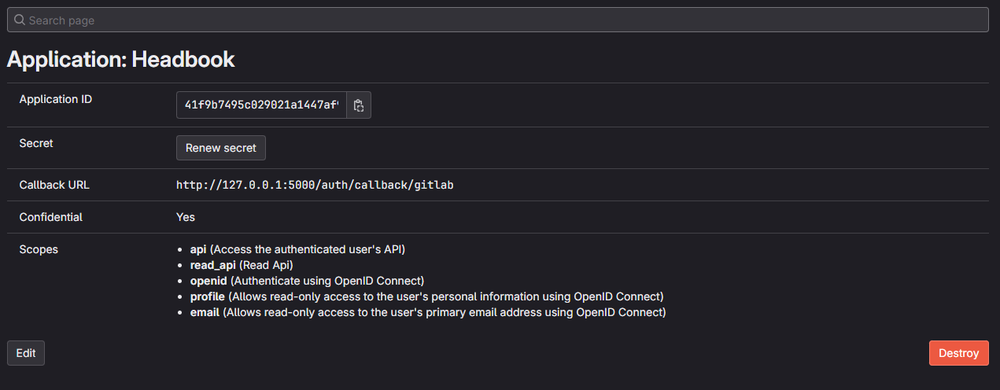

_Henrik Flo Wilhelmsen (hwi038)_

## 2a

To be able to inject sql into the database we can put spesific textinput into the input field to escape the original sql, for example

```sql
x'; INSERT into users (username, password, info) VALUES ('xxx', 'ppp', '{}'); --
-- or update a user
x'; UPDATE users SET username = 'zzz' WHERE id = 3; --
-- and a more dangerous one
x'; UPDATE users SET password = 'hacked' WHERE id = 3 OR 1=1; --
```

this will escape the original sql and then you can add your own sql, this happens because the input is directly passed into the sql string and can change the structure of the sql query

```py
@staticmethod
    def get_user(userid):
        if type(userid) == int or userid.isnumeric():
            sql = f"SELECT id, username, password, info FROM users WHERE id = {userid};"
        else:
            sql = f"SELECT id, username, password, info FROM users WHERE username = '{userid}';"
        row = sql_execute(sql).fetchone()
        if row:
            user = User(json.loads(row[3]))
            user.update({"id": row[0], "username": row[1], "password": row[2]})
            return user
```

to prevent this i will used prepared statement when i query the database with userinput, this will make sure that the input is not directly passed into the sql string and the structure will be the same

```py
def sql_execute(stmt, *args, **kwargs):
    debug(stmt, args or "", kwargs or "")

    return get_cursor().execute(stmt, (*args, ), **kwargs)
```

with this you also need do add ? to the original sql string where you want to add the userinput

```py
def get_user(userid):
        if type(userid) == int or userid.isnumeric():
            sql = f"SELECT id, username, password, info FROM users WHERE id = ?;"
        else:
            sql = f"SELECT id, username, password, info FROM users WHERE username = ?;"
        row = sql_execute(sql, userid).fetchone()
        if row:
            user = User(json.loads(row[3]))
            user.update({"id": row[0], "username": row[1], "password": row[2]})
            return user
```

## 2b

To be able to inject javascript into the homepage we can put spesific textinput into the about field, for example
inside about

```html
 {
          alert(`Your website has been hacked!`)
        }, 100);
        "
/>
```

inside color

```html
green"></div>

<div style="
```

you can use a button with onlick to trigger the alert but with onerror and a image that will always get error this method you can trigger the alert without clicking anything only rendering the img tag, in the color i can escape the html like we did in the sql injection and then i can put the img tag inside the div tag

this will inject javascript because the about input is directly passed to the innerHtml without any sanitization

```js
elt.innerHTML = `
        
        <div class="data">
            ${format_field('Name', user.username)}
            <div class="more">
                ${format_field('Birth date', user.birthdate)}
                ${format_field('Favourite colour', `${user.color} <div class="color-sample" style="${'background:'+user.color}"></div>`)}
                ${format_field('About', user.about, 'long')}
            </div>
        </div>
        <div class="controls">
```

you can prevent this by using Content Security Policy (CSP) to prevent the browser from executing any inline javascript, you can do this by adding a this in the after request

```py
@app.after_request
def after_request(response):
    response.headers["Content-Security-Policy"] = f"script-src 'nonce-{g.csp_nonce}' http://127.0.0.1:5000/script.js http://127.0.0.1:5000/uhtml.js;"
    return response
```

this will also prevent any inline javascript if you inspect element and add button with onclick from running. The same will happen if a userinput is not sanitized and displayed on the website.
This lets the app work as normal but it will not execute any inline javascript.

Another method to prevent this is to sanitize html where users can change the value. I made a function that sanitizes an input

```js
export const sanitizeInput = (input) => {
    const str = (input || '')
        .replace(/;/g, '&#059;')
        .replace(/</g, '&lt;')
        .replace(/>/g, '&gt;')
        .replace(/=/g, '&#061;')
        .replace(/"/g, '&quot;')
        .replace(/'/g, '&#039;');
    return str;
};
```

this will replace important characters with their html entities

by changing the format field i could use this function to sanitize the input, and to make it more dynamic i made a function that sanitizes all the fields by replacing ?0 ?1 ... with the sanitized inputs, i did this so you can add html inside the format_field value without having to escape each input manually

```js
export function format_field(key, value, options = {}, ...other) {
    // match for ?0, ?1, ?2, … in the value and replace with the corresponding argument
    // this lets me add HTML tags to the value wihout having to escape them everywhere
    const regex = /\?([0-9]+)/g;

    let match;
    while ((match = regex.exec(value))) {
        const index = parseInt(match[1]);
        value = value.replace(match[0]?.toString(), sanitizeInput(other[index]?.toString()));
    }
    // ..... rest of the code
    return `<li class="${classNames}"><span class="key">${key}</span>${value}</li>`;
}
```

example

```js
format_field(
    'Favourite colour',
    `?0<div class="color-sample" style="background:?0"></div>`,
    {},
    user.color,
);
format_field('About', '<i>?0</i>', 'long', user.about);
format_field('About', '<h1>?0</h1><p>?1</p>', 'long', user.username, user.about); // will sanitize both inputs before replacing them
```

## 2c

**Best practices for storing passwords:**

This app does not satisfy any of the best practices for storing passwords
The app stores the passwords in plain text in the database, this is not good because if someone gets access to the database they will have access to all the passwords.

And the password does not have any requirements, it can be as short as you want but theoretically empty but you can not get an empty password because in the update profile it has a check for if a password is in the form `if form.password.data:` and if form.password.data is "" that will be false and the password is not added. The password can be only numbers, this is not good because it will be easy to brute force the passwords.

to prevent this you can add more validators to the password field in the profile_form and the signup_form i added,

```py
    password = PasswordField('Password', [validators.equal_to('password_again', message='Passwords must match'), validators.Length(min=8, max=-1, message='Password must be minimum 8 characters long'), validators.Regexp('^(?=.*[a-z])(?=.*[A-Z])(?=.*\d)(?=.*(_|[^\w])).+$', message='Password must contain at least one lowercase letter, one uppercase letter, one digit and one special character')])
```

with this validation the password must be minimum 8 characters long and it must contain at least one lowercase letter, one uppercase letter, one digit and one special character

**2 + 3 For this task i created a new python script called utils and added 3 functions**

```py
import hashlib
import uuid

def hash_with_salt(password, salt):
    m = hashlib.sha256()
    m.update((salt + password).encode('utf-8'))
    return m.hexdigest()

def hash_password(password):
    salt = uuid.uuid4().hex
    return hash_with_salt(password, salt) + ':' + salt

def check_password(hashed, text):
    try:
      _hashed, salt = hashed.split(':')
      return _hashed == hash_with_salt(text, salt)
    except:
      return hashed == text
```

For the hash_with_salt function i used the sha256 algorithm to hash the password with the salt, and for the hash_password function i used the uuid4 to generate a random salt and then i used the hash_with_salt function to hash the password with the salt and then i added the salt to the end of the hashed password with a : in between so i can get the salt when i check the password, and for the check_password function i split the hashed password in the database and then i check if the input password is the same as the hashed password with the salt i have this in a try catch because if the hashed password is not splitable it will just try the password without hashing it. this is to make sure that the app will still work if the database is not updated with the new hashed passwords.

then in the login i used the check_password function to check if the password is correct
and in the profile and signup i used the hash_password function to hash the password before i save it to the database.

in route("/profile") i added hashing to the password if the user set it

```py
if form.validate():
    if form.password.data: # change password if user set it
        current_user.password = hash_password(form.password.data)

```

in route("/signup") i added hashing to the password before i save it to the database

```py
if form.validate():
    form.errors.clear()
    username = form.username.data
    password = form.password.data

    if User.get_user(username):
        form.username.errors.append("Username already taken")
    if form.errors:
        return render_template("signup.html", form=form)
    else:
        user = User({"username": username, "password": hash_password(password)})
        user.save()
```

and in the login i added check_password to check if the password is correct

```py
 if form.validate():
    username = form.username.data
    password = form.password.data
    user = user_loader(username)
    if user and check_password(user.password, password):
        login_user(user)
```

With the buddy system i made the format_profile async so could fetch the buddy status and then i added a check for if the user is friends or requested and if not i added a message that you need to be friends to see more this makes it so before the server gives any information about the user it checks if you are friends with the user

```js
export async function format_profile(user, elt) {
    if (!elt) elt = document.createElement('div');
    elt.classList.add('user'); // set CSS class
    if (user.id == current_user_id) {
        // current_user_id is a global variable (set on 'window')
        elt.classList.add('me');
    }

    const buddy = await fetch_json(`/buddies/${user.id}`, 'GET');

    let more = '';

    if (buddy.status != 'friends' && buddy.status != 'requested' && user.id != current_user_id) {
        more = '<i>Become friends to see more</i>';
    } else {
        more = `
            ${format_field('Birth date', '?0', {}, user.birthdate)}
            ${format_field(
                'Favourite colour',
                `?0<div class="color-sample" style="background:?0"></div>`,
                {},
                user.color,
            )}
            ${format_field('About', '<i>?0</i>', 'long', user.about)}
        `;
    }
    // ..... rest of the code
}
```

i also changes some routes so you could not bypass the buddy system in users/&lt;userid&gt;

```py
@app.get("/users/<userid>")
@login_required
def get_user(userid):
if userid == 'me':
    u = current_user
else:
    u = User.get_user(userid)

status = current_user.friend_status(u)

if status != "friends" and status != "requested" and status != "self":
    u = {
        "id": u.id,
        "username": u.username,
        "friend status": status,
    }
else:
    u = u.to_dict()
    u["friend status"] = status
    if status == "self":
        u[""] = "Your profile"
        del u["friend status"]

# ... rest
```

to make the buddy system work i added a route for getting the buddy status, post status and delete status

```py
@app.route("/buddies/<userid>", methods=["POST", "DELETE", "GET"])
@login_required
def get_buddie(userid):
    user = User.get_user(userid)

    if (not user):
        return jsonify({
                "ok": False,
                "error": "Invalid user",
            })

    if (request.method == "GET"):
        status = current_user.friend_status(user)
        return jsonify({
            "ok": True,
            "status": status,
        })

    action = request.headers.get("action")

    if (not action):
        return jsonify({
            "ok": False,
            "error": "No action specified",
        })

    if request.method == "POST":
        current_user.add_buddy(user)
        return jsonify({
            "ok": True,
            "action": action,
            "user": user.id,
        })
    elif request.method == "DELETE":
        current_user.delete_buddy(user)
        return  jsonify({
            "ok": True,
            "action": action,
            "user": user.id,
        })
```

and to the user i added a function to add and delete buddies

```py
def add_buddy(self, buddy):
    """Add a buddy to a user's buddy list"""
    return sql_execute(
        f"INSERT INTO buddies (user1_id, user2_id) VALUES (?, ?)", self.id, buddy.id
    )

def delete_buddy(self, buddy):
    """Delete a buddy from a user's buddy list"""
    sql_execute(
        f"DELETE FROM buddies WHERE user1_id = ? AND user2_id = ?", self.id, buddy.id
    )
    sql_execute(
        f"DELETE FROM buddies WHERE user1_id = ? AND user2_id = ?", buddy.id, self.id
    )
```

## 2d

### Other vounrabilities i have found in this app:

**you can do an sql injection in the in edit profile**

if you repeat the same password with this string you will update all the users password to the same password because i set the password where 1=1 which is always true and then all the passwords will be set to hacked

```sql
x' WHERE 'x'='y'; UPDATE users SET password='hacked_password' WHERE 1=1;--
```

and you can do the same in the fields about and color in profile to do the same sql injection
you cannot do it in picture_url or birthdate because the html input type is date and url and it will not accept any other input
so this can be fixed by using prepared statement like i did in the first sql injection

```py
 def save(self):
        """Save this user object to the database"""
        info = json.dumps(
            {k: self[k] for k in self if k not in ["username", "password", "id"]}
        )
        if "id" in self:
            sql_execute(
                f"UPDATE users SET username=?, password=?, info=? WHERE id=?;", self.username, self.password, info, self.id
            )
        else:
            sql_execute(
                f"INSERT INTO users (username, password, info) VALUES (?,?,?);", self.username, self.password, info
            )
            self.id = db.last_insert_rowid()
```

The app secret is not secure because its in the app.py and the value is a short string and a common string, this can be fixed by using a longer and more random string and put it in a .env file
i did this by adding a .env file and adding a random string MY_SECRET, and the loading it in the app.py, here i used another library called python-dotenv to load the .env file

```py
app.config["SECRET_KEY"] = os.getenv("MY_SECRET")
```

i also changed how Flask will store the session cookie, i changed it from the default to secure, this will make sure that the cookie is only sent over https and not http, i did this by adding this to the app.py

```py
app.config["SESSION_COOKIE_NAME"] = "headbook-session"
app.config['SESSION_COOKIE_SECURE'] = True
app.config['SESSION_COOKIE_HTTPONLY'] = True
app.config['SESSION_COOKIE_SAMESITE'] = 'Lax'
```

this will make sure that the cookie is only sent over https and not http, and it will also make sure that the cookie is not accessible by javascript and it will also make sure that the cookie is not sent to other sites

As i did in 2b i added Content Security Policy (CSP) to prevent the browser from executing any inline javascript, this will make it harder to inject javascript into the app.

### Other additions i have made to the app:

**i added a new page where you can sign up**

route: [/signup](http://127.0.0.1:5000/signup/)

## 2e

#### implementing openID connect

for this i used flask's authlib.integrations.flask_client
first i setup the OAuth with the provider

```py
oauth = OAuth(app)
oauth.register(
    name="gitlab",
    client_id=os.getenv("GITLAB_CLIENT_ID"),
    client_secret=os.getenv("GITLAB_CLIENT_SECRET"),
    server_metadata_url='https://git.app.uib.no/.well-known/openid-configuration',
    client_kwargs={'scope': 'openid profile email api read_api'},
)
```

then i added the new route for the login with gitlab and the callback

```py
@app.route('/auth/callback/gitlab')
def auth_callback():
    token = oauth.gitlab.authorize_access_token()
    userinfo = token["userinfo"]
    user = User.get_user(userinfo["preferred_username"])

    if user:
        login_user(user)
    else:

        newuser = User({
            "username": userinfo["preferred_username"],
            "password": hash_password(userinfo["sub"] + app.config["SECRET_KEY"]),
            "picture_url": userinfo["picture"],
            "name": userinfo["name"],
            "email": userinfo["email"],
        })

        newuser.save()
        newuser.add_token("gitlab")
        login_user(newuser)

    return safe_redirect_next()

@app.route('/login/gitlab/')
def login_gitlab():
    return oauth.gitlab.authorize_redirect(url_for('auth_callback', _external=True))
```

and then i added an apllication in gitlab and added the client id and client secret to the .env file



with this i could login using a gitlab account
